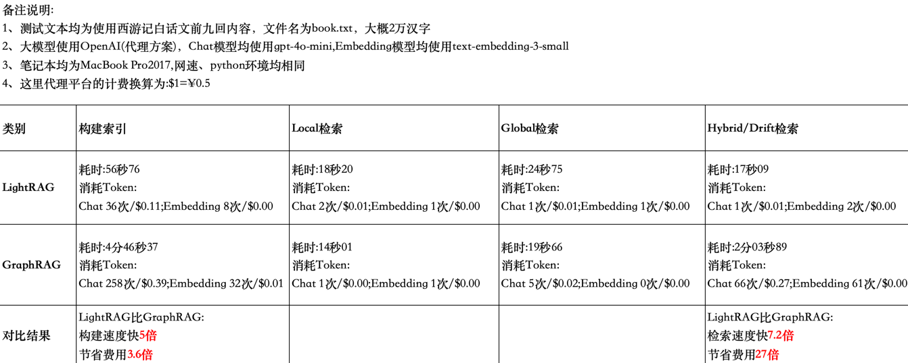

# 1、项目介绍
## 1.1、本次分享介绍
本期项目对GraphRAG和LightRAG进行对比测试          
**11月29日分享内容:本次分享主要内容为:**                               
(1)搭建LightRAG、GraphRAG                          
(2)LightRAG构建索引、naive检索、Local检索、Global检索、Hybrid检索                            
(3)GraphRAG构建索引、Local检索、Global检索、Drift检索                                                                      
(4)LightRAG与GraphRAG在索引构建、检索测试中的耗时、模型请求次数、Token消耗金额、检索质量等方面进行对比         
相关视频:                      
(1)LightRAG与GraphRAG对比评测，从索引构建、本地检索、全局检索、混合检索等维度对请求大模型次数、Token消耗、金额消耗、检索质量等方面进行全面对比                    
https://www.bilibili.com/video/BV1CmzEYcEnS/?vd_source=30acb5331e4f5739ebbad50f7cc6b949                       
https://youtu.be/-O5ATdQcefo             
(2)GraphRAG发布重大更新！增量更新索引终于来并新增DRIFT图推理搜索查询，带你手把手全流程实操新功能，源码分析，同时支持GPT、国产大模型、本地大模型等              
https://www.bilibili.com/video/BV1AADaYfE2T/                   
https://youtu.be/7WFMd8U8C7E                  

**12月01日分享内容:本次分享主要内容为:**                               
(1)LightRAG批量及增量构建索引，支持TXT、PDF、DOCX、PPTX、CSV等                                                                   
(2)LightRAG生成的知识图谱可视化展示，html方式和neo4j数据库方式                                                                                       
(3)LightRAG与GraphRAG基于neo4j数据库进行知识图谱可视化进行质量评测                 
相关视频:              
https://www.bilibili.com/video/BV1xXzoYGEJw/                
https://youtu.be/-IiyHQQdn34            

 

## 1.2 GraphRAG介绍
### (1)简介
GraphRAG 截止当前(11.29) 为0.5.0版本，该版本引入了增量更新索引和DRIFT图推理搜索查询(一种混合本地与全局的搜索的方法)                         
github地址:https://github.com/microsoft/graphrag            
官网地址:https://microsoft.github.io/graphrag/query/overview/           
### (2)定义
GraphRAG是微软研究院开发的一种创新型检索增强生成（RAG）方法，旨在提高大语言模型LLM在处理复杂信息和私有数据集时的推理能力                             
GraphRAG 是一种基于大型语言模型 (LLM) 的技术，用于从非结构化文本文档中生成知识图谱和摘要，并利用这些内容提升在私有数据集上的检索增强生成 (RAG) 效果                      
通过 GraphRAG，用户能够从大量非结构化的文本数据中提取信息，构建一个全局概览，同时还可以深入挖掘更为本地化的细节              
该系统借助 LLM 生成知识图谱，识别文档中的实体和关系，利用数据的语义结构响应复杂查询                  
最新消息是11.26凌晨，微软宣布将推出 GraphRAG 的全新迭代版本LazyGraphRAG     
核心亮点是极低的使用成本，其数据索引成本仅为现有GraphRAG 的 0.1%。此外，LazyGraphRAG 引入了全新的混合数据检索方法，大幅提升了生成结果的准确性和效率。该版本将很快开源，并纳入到 GitHub GraphRAG 库中            
原文链接如下:https://www.microsoft.com/en-us/research/blog/lazygraphrag-setting-a-new-standard-for-quality-and-cost/              
### (3)支持的检索方式       
**Local Search**     
本地搜索方法将知识图谱中的结构化数据与输入文档中的非结构化数据结合起来，在查询时用相关实体信息增强 LLM 上下文    
这种方法非常适合回答需要了解输入文档中提到的特定实体的问题         
**Global Search**       
根据LLM生成的知识图谱结构能知道整个数据集的结构（以及主题）     
这样就可以将私有数据集组织成有意义的语义集群，并预先加以总结。LLM在响应用户查询时会使用这些聚类来总结这些主题    
**DRIFT Search**                          
DRIFT 搜索通过整合社区信息，使本地搜索的起点更为宽泛，能够检索更多类型的事实，从而提升查询的详细性            
DRIFT 在 GraphRAG 的查询引擎基础上进一步扩展，为本地搜索提供了更精细的分层查询方式，使其能够处理与预定义模板不完全匹配的复杂查询             
### (4)相关GrahRAG视频
GraphRAG(基于知识图谱的RAG)系列合集                       
https://space.bilibili.com/509246474                                 
https://www.youtube.com/playlist?list=PL8zBXedQ0uflcyD-_ghqmjpv1lAdRdKJ-              

## 1.3 LightRAG介绍
### (1)简介
LightRAG 截止当前(11.29) 未发布release版本                                  
github地址:https://github.com/HKUDS/LightRAG                     
### (2)定义
LightRAG是香港大学开发的一种简单高效的大模型检索增强(RAG)系统                                             
它将图结构整合到文本索引和检索过程中。这一创新框架采用了双层检索系统，从低层次和高层次的知识发现中增强了全面信息检索        
此外，图结构与向量表示的整合便于高效检索相关实体及其关系，显著提高了响应时间，同时保持了上下文的相关性                                            
这种能力通过增量更新算法进一步增强，确保新数据能够及时整合，使系统在快速变化的数据环境中保持有效和响应性                            
### (3)支持的检索方式       
**Naive Search**            
Naive 模式是最简单的检索策略，它直接基于输入查询计算向量相似度，返回最接近的结果，不进行任何额外的优化或复杂处理            
**Local Search**          
Local 模式只在本地上下文范围内进行检索。它聚焦于用户当前输入的特定领域或某部分数据，不会考虑全局数据         
**Global Search**           
Global 模式会在整个知识库范围内进行检索，试图找到与查询最相关的信息，而不局限于当前上下文或局部区域            
**Hybrid Search**                                
Hybrid 模式结合了 Local 和 Global 的优势，同时考虑局部上下文和全局信息，综合结果以提高答案的相关性和覆盖范围                        

# 2、前期准备工作
## 2.1 开发环境搭建:anaconda、pycharm
anaconda:提供python虚拟环境，官网下载对应系统版本的安装包安装即可                                      
pycharm:提供集成开发环境，官网下载社区版本安装包安装即可                                               
可参考如下视频进行安装，【大模型应用开发基础】集成开发环境搭建Anaconda+PyCharm                                                          
https://www.bilibili.com/video/BV1q9HxeEEtT/?vd_source=30acb5331e4f5739ebbad50f7cc6b949                             
https://youtu.be/myVgyitFzrA          

## 2.2 大模型相关配置
(1)GPT大模型使用方案              
(2)非GPT大模型(国产大模型)使用方案(OneAPI安装、部署、创建渠道和令牌)                 
(3)本地开源大模型使用方案(Ollama安装、启动、下载大模型)                         
可参考如下视频:                         
提供一种LLM集成解决方案，一份代码支持快速同时支持gpt大模型、国产大模型(通义千问、文心一言、百度千帆、讯飞星火等)、本地开源大模型(Ollama)                       
https://www.bilibili.com/video/BV12PCmYZEDt/?vd_source=30acb5331e4f5739ebbad50f7cc6b949                 
https://youtu.be/CgZsdK43tcY           

# 3、项目初始化
## 3.1 下载源码
GitHub或Gitee中下载工程文件到本地，下载地址如下：                
https://github.com/NanGePlus/LightRAGTest                                                           
https://gitee.com/NanGePlus/LightRAGTest                                    

## 3.2 构建项目
使用pycharm构建一个项目，为项目配置虚拟python环境               
项目名称：LightRAGTest                                   

## 3.3 将相关代码拷贝到项目工程中           
直接将下载的文件夹中的文件拷贝到新建的项目目录中               

## 3.4 安装项目依赖          
命令行终端中执行如下命令安装依赖包                       
cd LightRAG                    
pip install -e .                   
cd GraphRAG             
pip install graphrag==0.5.0                   

# 4、11月29日分享内容相关测试
**测试文本** 测试文本均为使用西游记白话文前九回内容，文件名为book.txt                             
**模型配置** 大模型使用OpenAI(代理方案)，Chat模型均使用gpt-4o-mini,Embedding模型均使用text-embedding-3-small                        
**其他配置** 笔记本均为MacBook Pro2017,网速、python环境均相同                
## 4.1 LightRAG测试
### (1)构建索引
打开命令行终端，执行如下指令         
cd LightRAG/nangeAGICode                      
python test.py                
**注意** 在运行脚本之前，需要调整相关代码将如下代码块打开，检索相关的代码块注释         
### (2)逐一测试
执行如下指令         
cd LightRAG/nangeAGICode                   
python test.py                
**注意** 在运行脚本之前，需要注释如下构建索引代码，取消检索相关的代码块注释                  

## 4.2 GraphRAG测试
### (1)构建索引
打开命令行终端，执行如下指令                 
cd GraphRAG                    
graphrag index --root ./                           
### (2)逐一测试                 
graphrag query --root ./ --method local --query "这个故事的核心主题是什么?"                  
graphrag query --root ./ --method global --query "这个故事的核心主题是什么?"                  
graphrag query --root ./ --method drift --query "这个故事的核心主题是什么?"             

## 4.3 对比测试结论一览表
         

# 5、12月01日分享内容相关测试
**测试文本** 测试文本均为使用西游记白话文前九回内容                                             
**模型配置** 大模型均使用OpenAI(代理方案)，Chat模型均使用gpt-4o,Embedding模型均使用text-embedding-3-small                        
**其他配置** 笔记本均为MacBook Pro2017,网速、python环境均相同            

## 5.1 LightRAG构建索引测试
### (1)安装textract依赖包          
通过指令 pip install textract 安装时会报错，报错的原因是                               
其元数据文件中使用了不再被支持的版本约束符号（<=0.29.*），而当前 pip 和 setuptools 不再接受这种格式        
解决方案:下载依赖包源码，修改相应参数后本地进行安装                            
https://pypi.org/project/textract/1.6.5/#description                        
cd textract-1.6.5                        
pip install .                  

### (2) 创建neo4j数据库实例    
推荐使用云服务进行测试，链接地址如下:                    
https://console-preview.neo4j.io/tools/query                    
注册登录成功，直接新建实例即可                 

### (3)增量索引构建及知识图谱可视化测试
运行如下指令进行索引构建                             
cd LightRAG/nangeAGICode1201                  
python insertTest.py                    
python queryTest.py            
每一次构建完成，先清除数据库中的数据再运行如下指令进行可视化          
在运行之前需要根据自己的实际情况进行参数的调整            
python graph_visual_with_html.py              
python graph_visual_with_neo4j.py             
在数据库中进行查询测试           
MATCH (n:`PERSON`)                     
WHERE n.displayName CONTAINS '唐僧'                     
RETURN n LIMIT 25;                      

MATCH (n:`PERSON`)                   
WHERE n.displayName CONTAINS '八戒'                  
RETURN n LIMIT 25;               
           
MATCH (n:`PERSON`)                   
WHERE n.displayName CONTAINS '沙和尚'                        
RETURN n LIMIT 25;                       

**清除数据**                         
MATCH (n)                
CALL { WITH n DETACH DELETE n } IN TRANSACTIONS OF 25000 ROWS;               

### (4)LightRAG和GraphRAG生成的知识图谱对比           
运行如下指令将GraphRAG生成的知识图谱进行可视化展示            
cd GraphRAG/utils                    
python graph_visual_with_neo4j.py                 
在运行脚本前根据自己的实际情况进行调整,修改文件所在路径为存储增量数据的文件路径                                            
GRAPHRAG_FOLDER="/Users/janetjiang/Desktop/agi_code/LightRAGTest/GraphRAG/output"            
在数据库中进行查询测试                           
MATCH (n:`__Entity__`)          
WHERE n.name CONTAINS '唐僧'                
RETURN n LIMIT 25;             

MATCH (n:`__Entity__`)                 
WHERE n.name CONTAINS '八戒'                  
RETURN n LIMIT 25;      

MATCH (n:`__Entity__`)                  
WHERE n.name CONTAINS '沙和尚'                   
RETURN n LIMIT 25;         

**清除数据**                            
MATCH (n)                 
CALL { WITH n DETACH DELETE n } IN TRANSACTIONS OF 25000 ROWS;            
